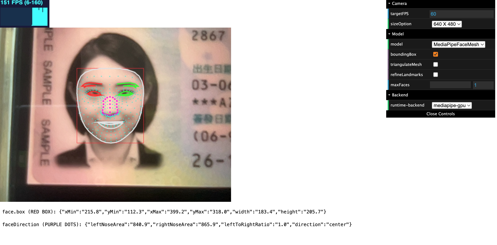

# tfjs-face-landmarks-demo

(Work-related) Compares TensorFlow.js face-landmarks-detection model [v0.0.3](https://github.com/tensorflow/tfjs-models/tree/face-landmarks-detection-v0.0.3/face-landmarks-detection) with [v1.0.6 with MediaPipe backend](https://github.com/tensorflow/tfjs-models/blob/face-landmarks-detection-v1.0.6/face-landmarks-detection/src/mediapipe)

## Getting Started

```bash
cd face-landmarks-0.0.3    # or face-landmarks-1.0.6
yarn
yarn watch
```

## Demo

v1.0.6:


